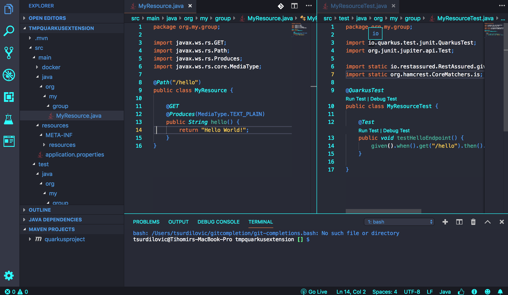

# Quarkus Dark Theme

Visual Studio Code Theme for Quarkus.
Based on the color theme of https://quarkus.io/

  

## Installation

1. Open the **Extensions** sidebar in VS Code
2. Search for `Quarkus Dark Theme`
3. Click **Install**
4. Open the **Command Palette** with `Ctrl+Shift+P` or `⇧⌘P`
5. Select **Preferences: Color Theme** and choose a Quarkus Dark.
6. Enjoy!
